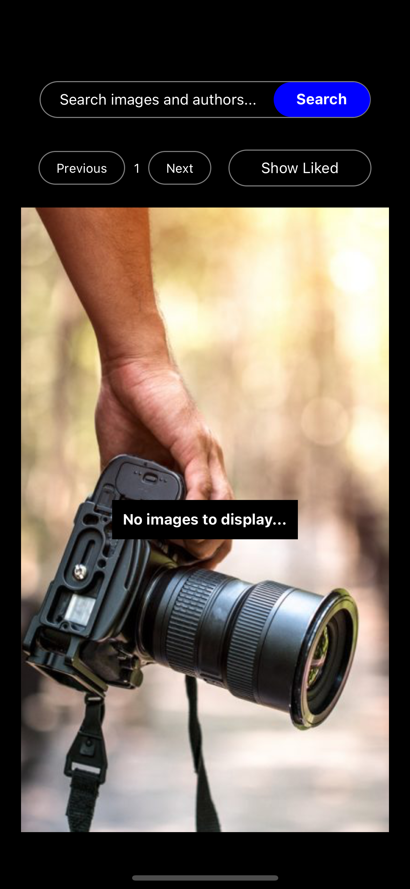
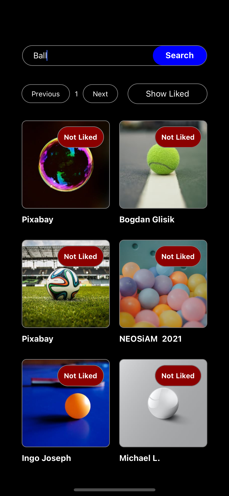
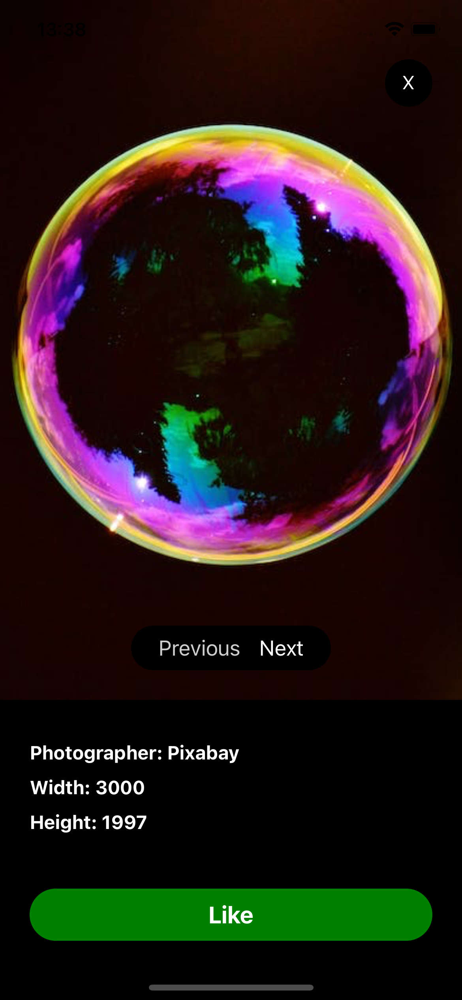
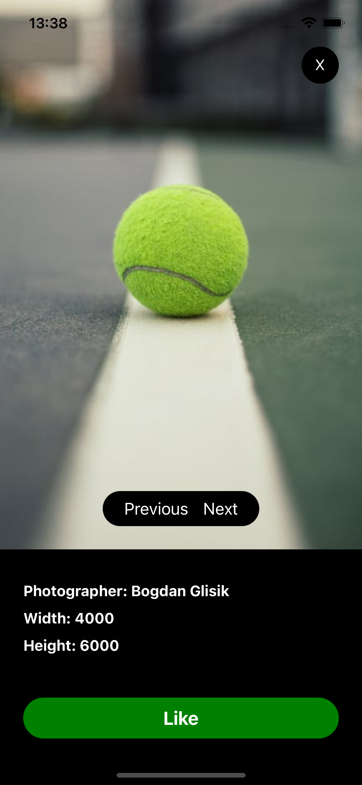
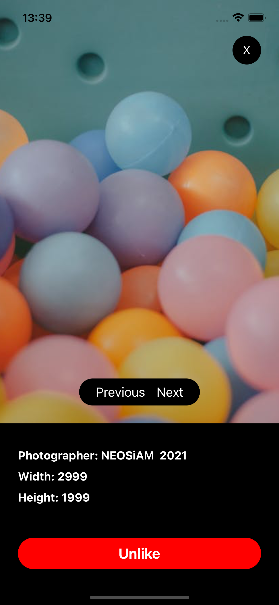
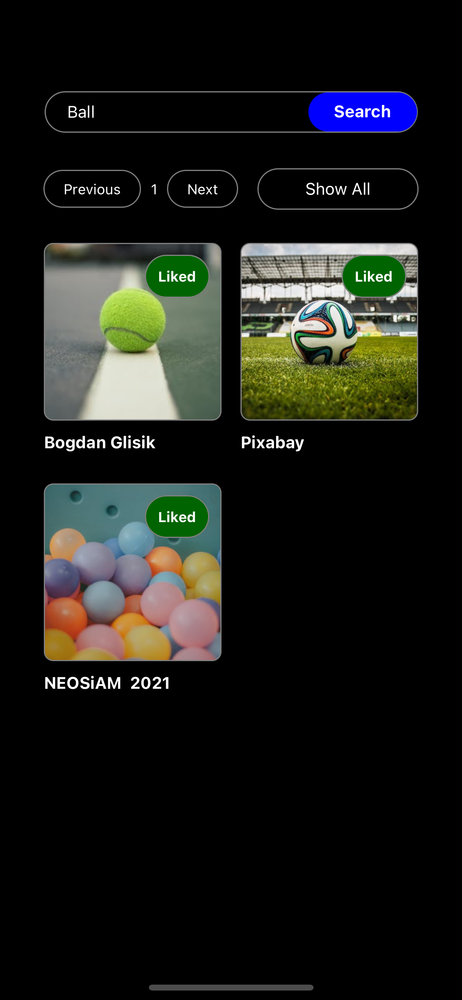
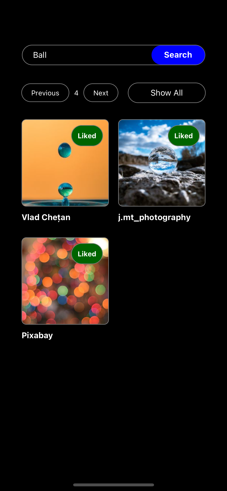
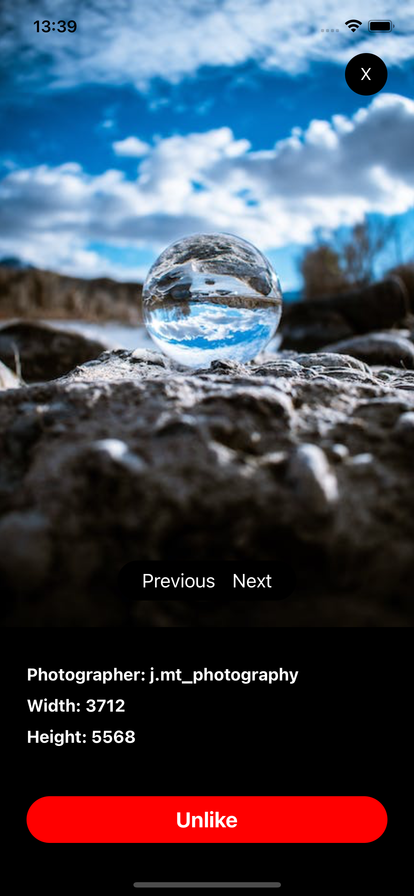
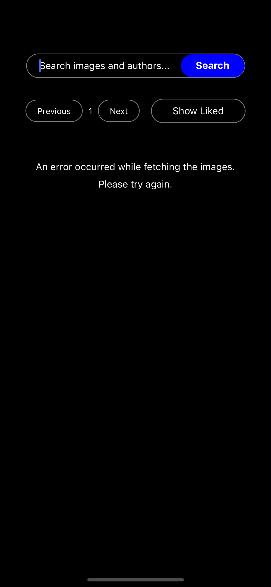

# Pexels Image Search

This a is a demo project developed for a job interview coding challenge that then got canceled (...)

Search the Pexels API for images, like them and have them saved for future reference or usage. Also retrives some information of does images such as author and dimensions.

        

## Features

- Modern UI
- Integration with Pexels API
- Saved data is persistant using Local Storage
- Searchbar
- Image Gallery
- Pagination
- Image Preview with controllers and info
- Filter based on search or liked images

## Getting Started

These instructions will give you a copy of the project up and running on
your local machine for development and testing purposes. See deployment
for notes on deploying the project on a live system.

### Prerequisites

Requirements for the software and other tools to build, test and push

- [React Native](https://reactnative.dev/docs/environment-setup)

### Installing

Navigate to the directory you wish to use

### Clone Repository

```sh
git clone https://github.com/bernabranco/PexelsImageSearch.git
```

In the root of the project:

### Install Dependencies

```sh
yarn
```

### Start Metro

```sh
yarn start
```

### Build the App

- For IOS:

```sh
cd ios && pod install && cd .. && yarn ios
```

## Contributing

Any contribution should be done by opening a Pull Request

## Authors

See also the list of
[contributors](https://github.com/bernabranco/PexelsImageSearch/contributors)
who participated in this project.

## License

No License, use it as you please ;)
